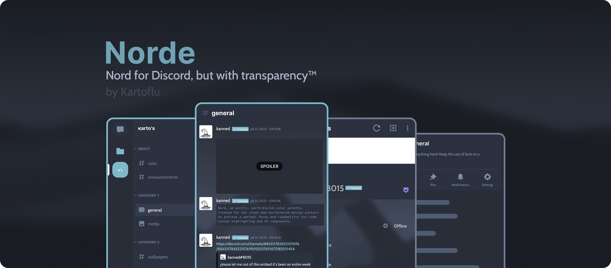

## Requirements
- [Aliucord](https://github.com/Aliucord/Aliucord) & [Themer](https://github.com/Vendicated/AliucordPlugins/tree/main/Themer) Installed (duh)
  - Transparency set to Chat & Settings
  - Enable Custom Fonts
- Dark Mode Enabled
- (Optional) Set Chat Font Scalling to 80% or any size that fits your preferences

## What's new?
### Norde v3.0.0 and Norde-Asterisk v2.0.0
- Another color tweak™
- Fixed some uncolored texts and icons + removed the annoying blur banding in background
- Switched font and background host from Discord to Github
- (Asterisk) Renamed norde* to norde-asterisk
### Nord-Schwa (Nord-ə) v1.0.0
- Initial release
##### You can check the full changelog [here](https://github.com/kartoflu/norde/blob/main/CHANGELOG.md)

## Manual Installation
Having troubles with regular installation? Try intalling the theme with this guide instead:
1. Download theme file from [Releases](https://github.com/kartoflu/midnight-espresso/releases/tag/v1.0.0)
2. Move the file you just downloaded to Aliucord/themes using a file explorer
3. Restart the app

Note: If your theme can't properly load in, it might be your device's fault. Please see #theme-support in [Aliucord Support Server](https://discord.gg/EsNDvBaHVU) (remember to read pins) to troubleshoot your issue.

## Visual Tweak/Plugin Config
You saw the previews, you know what's coming. To get your Discord client looks like in title preview, the proper settings of these folowing plugins is required:
### BetterChatbox
#### General
- Use old gallery button: Enabled
- Use small gallery button: Enabled
- Always show send button: Disabled
- Avatar display mode: None
- Leave the rest as default

#### Radii
- Chat box radius: Set as 57
- Button radius: Set as 57
- Leave the rest as default

#### Sizing
- Avatar size: Leave as default
- Chatbox height: Set as 114
- Button sizing: Set as 114

### NoBurnIn: Enable these folowing
- Unread counter
- Drawer button
- Search button
- Member button
- Call button
- Video button
- Leave the rest disabled

### LayoutController: Enable these folowing
- Remove call button from the user sheet
- Remove the Nitro Gift button
- Remove the Wave button in blank DMs
- Remove the invite button in channels list
- Remove the invite button in members list
- Remove the student hubs button in the server list
- Remove the wellcome button on join messages

### Bonus
- **CustomTimestamp**: Set the custom timestamp format as `MMM dd, yyyy - hh:mm:ss`
- **SquareAvatars**: Simply install the plugin. That's it.

## Previews
### (If you're on mobile, tap on the preview to open it in new tab)

<!-- pshh, wanna know a fact? i barely used the actual nord color pallete in the making of norde, asterisk and even schwa. in other words, i made a set of rip-off nord themes and you all fell for it (kekw) -->
